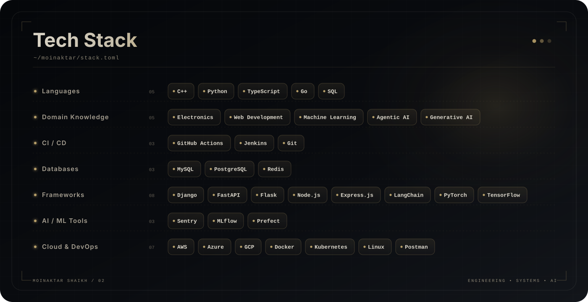
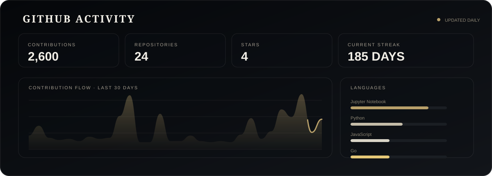
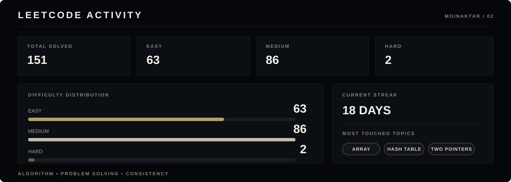

  

---

## Engineer working on engineering.

- Building toward deeper understanding of Software, Infrastructure and AI with security first, scalability next mindset.
- Currently looking for Ai Engineering, Backend and Full stack role

---

  

---

## 🏆 Certifications

  

  

  

---

## 🌐 Connect With Me

  
  
  

